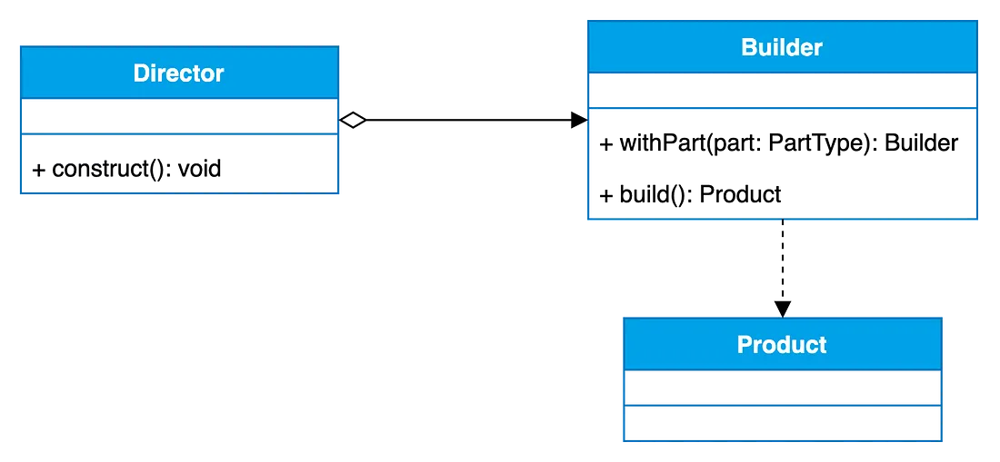

# Builder Design Pattern

- The Builder Pattern is a creational design pattern used to construct complex objects step by step.
- It seperates the construction of a complex object from its representation, allowing the same construction process to create different representations.

Here's a breakdown of the main components and how the Builder Pattern works:

1. Director : This is an optional component that orchestrates the construction process (in our case will be directly the client code). It collaborates with the builder to construct the object in a specific order or sequence.

2. Builder : The Builder interface defines methods for constructing parts of the complex object. It typically methods for adding components, setting attributes, or configuring various aspexts of the object being built. However, in some implemenentations, the Builder interface may be omitted.

3. Concrete Builders : These are concrete implementations of the Builder interface. Each concrete builder provides its own implementation for constructing the complex object. Depending on the specific requirements, there may be multiple concrete builders available.

4. Product : This is the complex object being constructed. It's the end result of the construction process. The product class represents the object being built, and it may have various attributes, properties, or methods. In our example, the Product is represented by the Computer class.
 

### Benefits

1. Flexibility : Constructs various representation of objects.
2. Reduced Duplicatoin : Mitigates code duplication that arises from numerous constructors.
3. Easy to Edit : Adjust the object's construction steps without influencing the object's code.

### Drawbacks:

1. Code Complexity : May increase complexity due to new interfaces and classes. 
2. Limit Validaton: The pattern may struggle with property-specific validation such as mutually exclusive properties