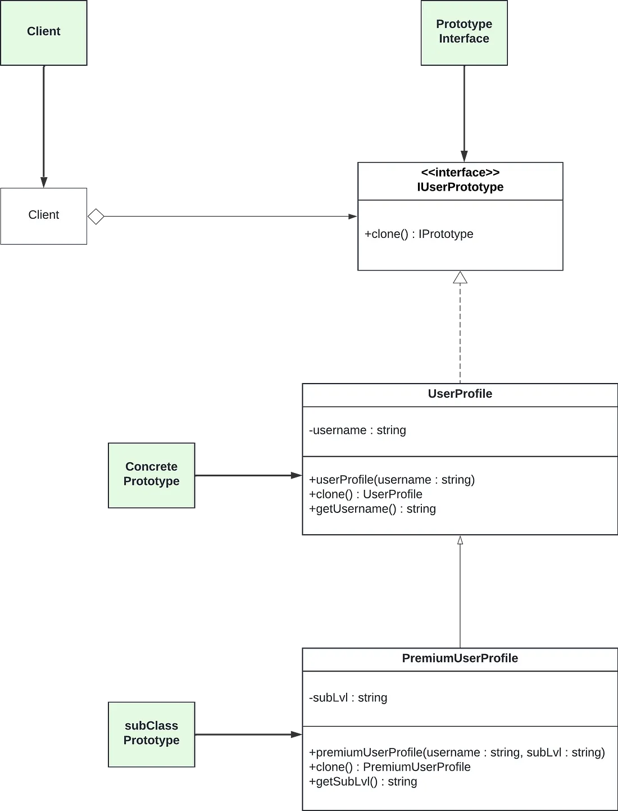

# Prototype

## What is Prototype Design Pattern?

- The Prototype design pattern is a creation design pattern.
- It provides the ability to clone objects without rebuilding them from scratch.
- With the prototype design pattern, the clone objects do not form dependencies with original object's relationships.

There are a few terminologies in the prototype design pattern. These are :
- Prototype Interface : Define the requirements for the clone method.

- Concrete Prototype : It implements the prototype interface and handles the requirements defined in the prototype interface.

- Subclass Prototype : When defined, it overrides the cloning method in the concrete prototype to further alter the cloned object.

- Client : It's application or function that initiates the cloning process.

## When should the prototype design pattern be used?

- The prototype design pattern can be used when the objects that are going to be cloned do not need to depend on concrete classes.
- By utilizing the prototype interface, objects can be cloned without creating the clone object from scratch.

This approach not only enables the effortless replication objects but also allows for alterations in the cloned instances by manipulating clone classes, resulting in the creation of diverse types of clones.

## How to implement prototype design pattern in Typescript

- Let's imagine a scenerio where we have a social media membership application. 
- we decide to add a new feature - premium membership.
- For this feature to work, we need to assign subscription levels to users and specify their subscription level.
- To achieve this, we plan to replicate user objects to fit out premium structure. 
- Hwowever, attempting to rebuild users froms scratch for our new feature could lead to complications due to the complexity of our existing user base. This situation hampers the correct construction of users. 

- Instead of trying to rebuild users and recreate the same complex structures, we opt to employ the prototype design pattern.
- Through this approach, we establish a connection with the user at a higher level using a prototype interface. 
- With this interfcem we copy out users without reconstructing their intricate structures from scratch.
- Essentially we copied their current structure in the user base with the help of the prototype interface.

 

